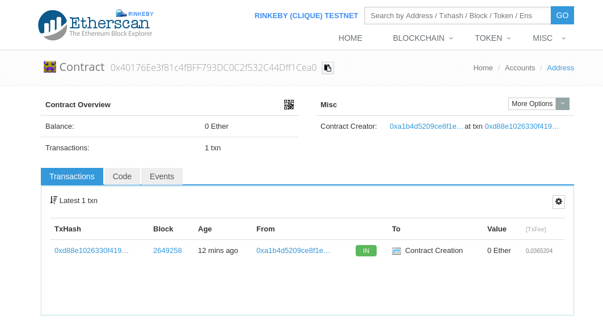

# eth-voting

Ethereum dapp study

# 基本开发 voting-v1
1. 使用`ganache-cli` 快速搭建本地开发测试环境
2. 手动编译并部署合约

## 测试环境搭建
1. 安装nodejs
2. 安装开发工具，npm install ganache-cli web3@0.20.2 solc
3. 创建并运行开发测试节点，./node_modules/.bin/ganache-cli
4. 编译部署合约
```
Web3 = require('web3')
# 连接测试节点
var web3 = new Web3(new Web3.providers.HttpProvider("http://127.0.0.1:8545"))
# 编译合约
var code = fs.readFileSync('volting.sol').toString()
var solc = require('solc')
compliedCode = solc.compile(code)
abiDefifnition = JSON.parse(compliedCode.contracts[':Voting'].interface)
# 初始化部署合约
VotingContract = web3.eth.contract(abiDefifnition)
deployedContract = VotingContract.new(['Rama', 'Nick', 'Jose'], {data: byteCode, from: web3.eth.accounts[0], gas: 4700000})
# 获取合约地址, 部署完成
deployedContract.address
```

## Vote 流程
1. `eth_accounts` 获取当前账号列表，取第一个用户交易

req:
```
{
    "jsonrpc": "2.0",
    "id": 19,
    "method": "eth_accounts",
    "params": []
}
```
resp:
```
{
    "id": 19,
    "jsonrpc": "2.0",
    "result": [
        "0x1658d981b081537973b24ca57d12a1515f028403",
        "0x34358711ad76f21eb8a3297e693fa22f999c7df6",
        "0x80ea81d1a687b89c12a294b70a546cdd7f6cebd7",
        "0xaa830fab767b97ac885548c0f3a77b0b7b76d5bf",
        "0xb9b92cb9e6ca9b8effccce7bf9bd73bd4f3e4a19",
        "0xaff5ed507fa170bdcd5849d72369866b5a443dd9",
        "0xd58da7d53fa4e0e39898520019b786a7b3572e4a",
        "0x588f2aef3e91379e4106c507921bd63caa37645e",
        "0x453590be9a2303001aa17b6eaddb32965af57f0a",
        "0x87ff55e3a1422e0e4d0798fcad8843a11aed0768"
    ]
}
```
2. `eth_sendTransaction` vote投票，使用第一个账号往合约地址发送交易

req:
```
{
    "jsonrpc": "2.0",
    "id": 20,
    "method": "eth_sendTransaction",
    "params": [
        {
            "from": "0x1658d981b081537973b24ca57d12a1515f028403",
            "to": "0xcb2bb35e231fdeb18c6b3c3c1007d9d2ac526c35",
            "data": "0xcc9ab2674a6f736500000000000000000000000000000000000000000000000000000000"
        }
    ]
}
```

resp:
```
{
    "id": 20,
    "jsonrpc": "2.0",
    "result": "0x0343e898cf783d0b03f0eb0e0c1f5d218f9322c19d0e60dfb2942000b7c4df74"
}
```

3. `eth_call` 获取投票信息

req:
```
{
    "jsonrpc": "2.0",
    "id": 21,
    "method": "eth_call",
    "params": [
        {
            "to": "0xcb2bb35e231fdeb18c6b3c3c1007d9d2ac526c35",
            "data": "0x2f265cf74a6f736500000000000000000000000000000000000000000000000000000000"
        },
        "latest"
    ]
}
```

resp:
```
{
    "id": 21,
    "jsonrpc": "2.0",
    "result": "0x0000000000000000000000000000000000000000000000000000000000000005"
}
```

# 进阶开发 voting-v2
1. 使用ethereum `geth`或`mist` 搭建公共测试环境`rinkeby`
2. 使用`Truffle` 开发框架

## 测试环境搭建
1. 完成`基本开发`测试环境搭建
2. 安装`geth`，可选安装[mist](https://github.com/ethereum/mist/releases) 用于查询块信息等
3. 切换到`rinkeby test network`，访问https://www.rinkeby.io/#faucet 或http://faucet.ropsten.be:3001/获取`ether`
4. 安装`Truffle` 开发框架，`npm install -g truffle webpack`
5. 安装`webpack` 打包依赖，`npm install --save web3@0.20.2 jquery@3.1.1`

## 部署
启动geth
```
./geth --rinkeby --cache 1024 --rpc --rpcapi db,eth,net,web3,personal --rpcport 8545 --rpcaddr 127.0.0.1 --rpccorsdomain "*" --syncmode light
```

连接节点
```
truffle console
```

查看账号
```
truffle(development)> web3.personal.listAccounts
[ '0xa1b4d5209ce8f1ea769778d0e325bff206200ee9' ]
```

解锁账号
```
truffle(development)> account = web3.personal.listAccounts[0]
'0xa1b4d5209ce8f1ea769778d0e325bff206200ee9'
truffle(development)> web3.personal.unlockAccount(account, '123456', 15000)
true
```

部署
部署完成后Voting 合约地址为`0x40176ee3f81c4fbff793dc0c2f532c44dff1cea0`
```
$ truffle migrate
Using network 'development'.

Running migration: 1_initial_migration.js
  Deploying Migrations...
  ... 0x700e705d8a0db82b699987c8f74825b8f09dde83e5ea8c49c6b148ff2f7ec335
  Migrations: 0x241685f86c892865154153c0fadf9a7a110ba15f
Saving successful migration to network...
  ... 0xa31f614f4e83fb20bb1418dac6c6fd78174e761b9533749223504d21f698bab7
Saving artifacts...
Running migration: 2_deploy_contracts.js
  Deploying Voting...
  ... 0xd88e1026330f4197afd11a8e3087b26fcfe21cbc04c8b55c8e809595838b88c9
  Voting: 0x40176ee3f81c4fbff793dc0c2f532c44dff1cea0
Saving successful migration to network...
  ... 0x59c3acedaad929ba092caf6894d78aa738dfbc0178c8e8123dc9c9220fd85a4d
Saving artifacts...
```

相关geth 日志
```
INFO [07-17|14:27:49] Submitted contract creation              fullhash=0x700e705d8a0db82b699987c8f74825b8f09dde83e5ea8c49c6b148ff2f7ec335 contract=0x241685F86c892865154153c0FaDf9a7a110bA15f
INFO [07-17|14:28:24] Submitted transaction                    fullhash=0xa31f614f4e83fb20bb1418dac6c6fd78174e761b9533749223504d21f698bab7 recipient=0x241685F86c892865154153c0FaDf9a7a110bA15f
INFO [07-17|14:28:54] Submitted contract creation              fullhash=0xd88e1026330f4197afd11a8e3087b26fcfe21cbc04c8b55c8e809595838b88c9 contract=0x40176Ee3f81c4fBFF793DC0C2f532C44Dff1Cea0
INFO [07-17|14:29:39] Submitted transaction                    fullhash=0x59c3acedaad929ba092caf6894d78aa738dfbc0178c8e8123dc9c9220fd85a4d recipient=0x241685F86c892865154153c0FaDf9a7a110bA15f
```

查看合约信息
```
truffle console
Voting.address
truffle(development)> Voting.address
'0x40176ee3f81c4fbff793dc0c2f532c44dff1cea0'
```


## 总结
1. 往合约地址发送交易可以调用合约函数
2. 本地开发可以使用ganache-cli 在内存中快速创建ethereum 模拟环境
4. 与合约交互，必须要知道合约地址和合约ABI（或源码) 

## 参考连接
- https://medium.com/@mvmurthy/full-stack-hello-world-voting-ethereum-dapp-tutorial-part-1-40d2d0d807c2
- https://medium.com/@mvmurthy/full-stack-hello-world-voting-ethereum-dapp-tutorial-part-2-30b3d335aa1f
- https://ethereum.stackexchange.com/questions/15603/web3-js-get-contract-abi-knowing-only-contract-address


# 问题
0. DAPP 如何保存在链上?
1. DAPP 如何执行?
2. DAPP 产生的数据如何存储？